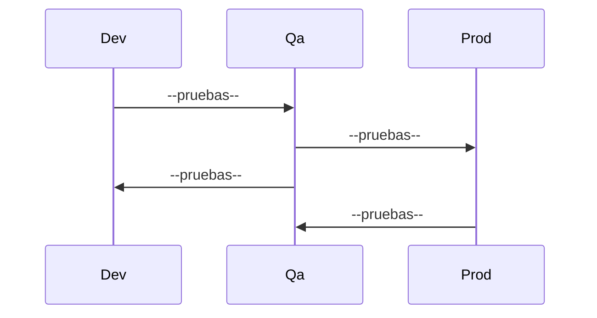
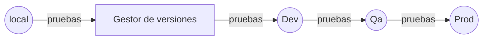

# Kambista QA challenge 🐞!

👋 Estamos en la búsqueda de una persona que nos ayude a ofrecer un servicio de mejor calidad.  Queremos conocer un poco más tus habilidades y nos gustaría que puedes realizar el siguiente #qachallenge 

## 📓 Caso

En Kambista surgió el requerimiento de realizar un nuevo proceso de autenticación. Nuestro scrum master registro las siguientes historias:

 - Nueva funcionalidad de login
 - Nueva funcionalidad de registro

El equipo de tecnologia realizo sus tareas y ahora te toca a ti certificar que dichas actividades se realizaron correctamente 🙌. 

### Requerimientos
Los criterios de aceptación para el registro son los siguientes:

- El correo ingresado debe tener un @ para ser válido.
- La contraseña debe tener como mínimo 5 caracteres.
- El correo y la contraseña son requeridos obligatoriamente.
- El sistema debe mostrar un mensaje de error al ingresar campos no válidos.

Los criterios de aceptación para el login son los siguientes:

- El correo ingresado debe tener un @ para ser válido.
- La contraseña debe tener como mínimo 5 caracteres.
- El correo y la contraseña son requeridos obligatoriamente.
- El sistema debe mostrar un mensaje de error al ingresar campos no válidos.

>💡 Todos los requerimientos deben ser considerados para las validaciones front como back.

### Flujo de trabajo

Se maneja varios ambientes de trabajo (desarrollo, qa, produccion) a lo largo del desarrollo del producto. Consideramos que la calidad debe asegurarse en todo el flujo, por lo tanto las pruebas debes realizarce en cada uno de los ambientes propuestos.

> Puede sugerirse otra estructura

Tambien se tiene una integración continua y una entrega continua, esto quiere decir que el trabajo realizado por cada unos de los miembros de equipo se centraliza y debe que ser evaluado antes de enviar una nueva versión al siguiente ambiente propuesto.

> Puede sugerirse otra estructura

## 🏁 Como empezar

    $ docker-compose up

## 🚀 Objetivos

1. Identifica las tareas y/o casos de prueba que estarían enlazadas a las requerimientos propuestos.
2. Implementa los tipos de pruebas que consideres necesarios ( unitarias, servicios, funcionales , manuales, etc), de tal manera que se pueda evaluar los requerimientos solicitados. Se debe agregar a ese repositorio una capeta llamada qa, donde se encuentre todo el código desarrollado.
4. Comentar sobre el flujo y los ambientes de trabajo y sugiere mejoras.
5. Sugerir en qué ambiente y en qué momento del flujo de trabajo se deben ejecutar cada tipo de pruebas.
6. Crea un pull request / merge request para poder evalular la prueba y notificar a christian@kambista.com para continuar con el proceso.

> 🔖  Considereaciones
> - La documentación y la parte de redación de la prueba debe ser realizada en un archivo README.md dentro de la carpeta qa.
> - Se tendra en cuenta los commits realizados para completar la prueba.
 
Exitos y gracias por tu tiempo!😃

> ☝ Ante cualquier duda puedes enviar un correo a christian@kambista.com y estaremos encantados de ayudarte. 